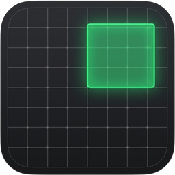
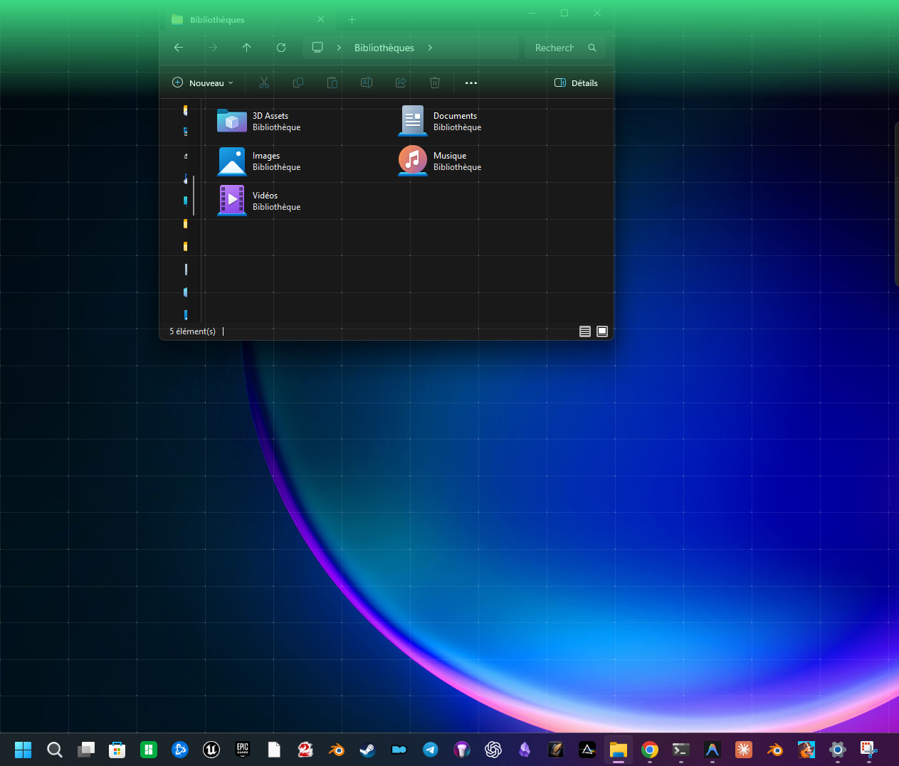
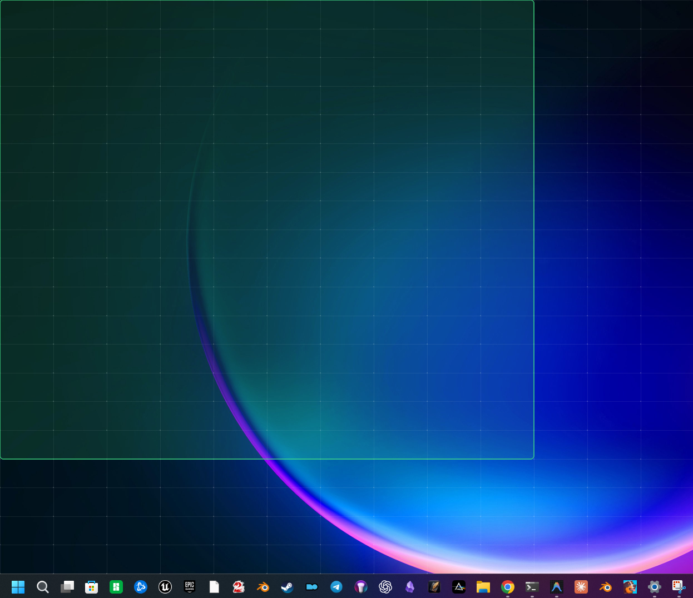

<p align="center">
  
</p>

<h1 align="center">Compono</h1>

<p align="center">Grid based window placement overlay for Windows.</p>

<p align="center">
  <a href="https://github.com/infinition/compono/actions/workflows/ci.yml"></a>
  <a href="https://github.com/infinition/compono/releases/latest"></a>
  
  <a href="LICENSE"></a>
</p>

## Overview

Compono is a lightweight, high-performance window manager and placement overlay for Windows. Drag a window to any screen edge or use hotkeys to snap, resize, or navigate windows across a configurable grid.

Unlike default Windows Snap, Compono applies direct `SetWindowPos` geometry, reliably managing elevated processes (Command Prompt, PowerShell, Windows Terminal), WinUI applications, and XAML Island windows across multi-monitor setups.

## Screenshots

| Edge Detection & Halo Trigger | Custom Rectangle Selection |
|---|---|
|  |  |
| *Screen edge dwell detection triggers the grid overlay.* | *Click and drag to trace your exact target window rectangle.* |

## Features

- **Fast Edge Dwell Detection**: Drag any window to a screen edge and hold for 250 ms to open the full-screen grid.
- **Custom Rectangle Drawing**: Drop the window on the grid, draw any target rectangle, and release to place.
- **Keyboard Snapping (`Ctrl+Alt+Arrows`)**: Instant cycling between halves, quarters, two-thirds, corners, and full screen.
- **Grid Navigation (`Alt+Arrows`)**: Move windows cell-by-cell on the grid using arrow keys.
- **Multi-Monitor Seamless Transition**: Moving a window past screen boundaries jumps directly to the adjacent monitor.
- **Quick Close Button**: Click the dedicated close cell (marked with a red cross) at the top-right corner to exit the grid.
- **Windows Snap Integration**: Toggle native Windows Snap on or off directly from the tray with clean Explorer reload.
- **Multi-Monitor and Per-Monitor DPI Aware**: Hardware-accelerated Direct2D and DirectComposition rendering.
- **Bilingual**: French and English interface automatically matching your system locale.

## Shortcuts

| Shortcut | Action | Description |
|---|---|---|
| `Win+Alt+G` | Toggle grid overlay | Opens or closes the placement grid on the active monitor |
| `Ctrl+Alt+Left` | Snap horizontal left | Cycles: 1/2 (50%) -> 1/4 (25%) -> 2/3 (66.6%) -> 1/2 (100% height) |
| `Ctrl+Alt+Right` | Snap horizontal right | Cycles: 1/2 (50%) -> 1/4 (25%) -> 2/3 (66.6%) -> 1/2 (100% height) |
| `Ctrl+Alt+Up` (from side) | Snap corner / top half | Cycles: Top corner (1/4) -> Fine corner (1/8) -> Full top half (1/2) -> Full screen |
| `Ctrl+Alt+Down` (from side) | Snap corner / bottom half | Cycles: Bottom corner (1/4) -> Fine corner (1/8) -> Full bottom half (1/2) |
| `Ctrl+Alt+Up` (direct) | Snap vertical top | Cycles: Top half (50%) -> Top quarter (25%) -> Full screen (100%) |
| `Ctrl+Alt+Down` (direct) | Snap vertical bottom | Cycles: Bottom half (50%) -> Bottom quarter (25%) |
| `Alt + Arrows` (hold Alt) | Grid cell movement | Moves the active window step-by-step across grid cells |
| `Alt + Arrows` (at screen edge) | Cross-monitor jump | Jumps window and grid focus to the adjacent screen |
| `Esc` / Release `Alt` | Confirm & exit grid | Locks window position and hides the overlay |

## Usage

### 1. Edge Drag and Drop

1. Drag any window to a screen edge (left, right, top, or bottom) and hold for **250 ms**.
2. The grid overlay appears with an edge halo. Release the mouse button.
3. Click and drag across grid cells to define your destination rectangle.
4. Release the click: the window is placed and focused.
5. To cancel: click the top-right cell marked with `✕`, right-click, or press `Esc`.

### 2. Keyboard Grid Navigation

1. Snap a window using `Ctrl+Alt+Arrows`.
2. Release `Ctrl` while keeping `Alt` pressed.
3. Press any arrow key (`Left`, `Right`, `Up`, `Down`) to step the window across the grid.
4. If you reach the edge of a monitor, pressing the arrow key again moves the window to the adjacent monitor.
5. Release `Alt` to lock the window into position.

### 3. Tray Menu

Click or right-click the Compono icon in the taskbar notification area:

- **Show grid / Hide grid** (`Win+Alt+G`).
- **Start with Windows**: Toggle automatic startup via `HKCU\Software\Microsoft\Windows\CurrentVersion\Run`.
- **Windows Snap**: Toggle OS native window snapping (updates registry and triggers `SPI_SETWINARRANGEMENT`).
- **Quit**: Exits Compono and unregisters hooks.

## Administrator Privileges

Compono requests `requireAdministrator` via its application manifest. Under Windows User Interface Privilege Isolation (UIPI), standard processes cannot move or resize windows belonging to elevated processes. Running Compono elevated allows it to manage all desktop windows, including administrator consoles and terminals.

## Installation

1. Download the latest release from the [Releases page](https://github.com/infinition/compono/releases).
2. Extract the archive.
3. Run `compono.exe` (accept the standard UAC elevation prompt).

## Configuration

Compono creates its configuration in `%APPDATA%\Compono\config.toml`:

```toml
lang = "en" # "en" or "fr"
```

If omitted, Compono automatically follows the Windows system language.

## Building from Source

Requires Rust 1.85 or later on Windows:

```powershell
cargo build --release
```

The optimized binary is created at `target/release/compono.exe`.

## License

MIT License. See [LICENSE](LICENSE) for details.
